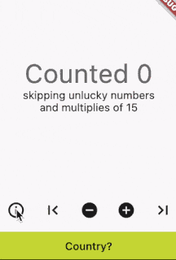

<!-- Copyright (c) 2022 Wojciech S. Czarnecki, aka Ohir Ripe -->

## UiModel, a lean and clean state managnment for Flutter Apps.

Package `uimodel` helps to build comprehensible Models and ViewModels for Flutter apps, then have it linked with UI in a single line per your custom Widget.

[UiModel] mixin is a thin wrapper around [Toggler](https://github.com/ohir/toggler), an (observable) state machine register that runs underhood your Models. It exposes a subset of Toggler api useful in Widget `build` method.

[UiModelLink] mixin adds the magic _watches(model, changes-mask)_ link layer to the Widget.

[UiNotifier] is a concrete implementation of a _ToggledNotifier_ that talks directly to Flutter [Element]s of your UI Widgets.

Together these allow a "_StatelessWidget with UiModelLink_" to observe changes in "_Model with UiModel_", and rebuild accordingly. All by a single `watches` invocation in the Widget's `build`:
```Dart
// in mymodels.dart:
class ViewModel with UiModel {...} // below seen as 'm' singleton

// in mywidget.dart:
class MyWidget extends StatelessWidget with UiModelLink {
  MyWidget({ Key? key, }) : super(key: key);
  @override
  Widget build(BuildContext context) {
    watches(m, smDn | smUp | smEnd ); // three flags/events in 'm' observed
    // watches(m.viewmodel, smPos | smAlt | smEnd ); // or in m.submodel
```
_Example App with state management based on [Toggler](https://github.com/ohir/toggler) then linked to Flutter View with [UiModelLink] can be found in the [example/main.dart](file:///example/main.dart) file.  Both UI and Model code is also given at bottom of this README_.

## Toggler based ViewModels, a HOWTO

- [ ] TODO

## Example App:


## UI code:
```Dart
import 'package:flutter/material.dart';
import 'package:uimodel/uimodel.dart'; // UiModel, UiModelLink
import 'package:toggler/toggler.dart'; // for DebugInfoBar UI and our Model

final m = ViewModel(); // "ambient" singleton instance

void main() {
  runApp(const MyApp());
}

class MyApp extends StatelessWidget {
  const MyApp({super.key});

  @override
  Widget build(BuildContext context) {
    return MaterialApp(
      title: 'Toggler and UiModel Example',
      theme: ThemeData(
        primarySwatch: Colors.lime,
      ),
      home: const Scaffold(
        body: CounterView(),
      ),
    );
  }
}

/// main route page
class CounterView extends StatelessWidget {
  const CounterView({
    Key? key,
  }) : super(key: key);

  @override
  Widget build(BuildContext context) {
    return Column(mainAxisAlignment: MainAxisAlignment.center, children: [
      Counter(),
      DebugInfoBar(),
      const OperatorBar(),
      CountryBar(),
    ]);
  }
}
```
View is wired to its ViewModel notifier with masks (prefixed _sm_) of a Toggler index (prefixed _tg_). Both are const int numbers. Indice are used to read and set flags state, masks are used to select more than one flag to observe. _You may generate index/mask pairs using script that comes with [Toggler](https://github.com/ohir/toggler/blob/main/tool/print_named_indice.dart) package._
```Dart
const tgUp = 10; // tgIndex (of tgUp change signal)
const smUp = 1 << tgUp; // smMask (of above tgIndex)
const tgDn = 11;
const smDn = 1 << tgDn; // ...more definitions ommited here

/// link Counter to UiModel (here explicitly via UiModelLink mixin. (In Widgets
/// below we will use `extends UiModeledWidget` shim, it means the same).
class Counter extends StatelessWidget with UiModelLink {
  Counter({
    Key? key,
  }) : super(key: key);
  @override
  Widget build(BuildContext context) {
    watches(m, smDn | smUp | smInfo); // three flags/signals in 'm' observed
    // watches(m.submodel, smSubSmth | smSubOther); // here: two of submodel
    return Expanded(
        child: Center(
      child: ListView(shrinkWrap: true, children: [
        Column(
          children: [
            Text(
              'Counted ${m.ctTxt}', // read straight from Model
              style: Theme.of(context).textTheme.headline4,
            ),
            m[tgInfo] // if tgInfo is set, display 'label' with debug info
                ? Text(m.label)
                : const Text(
                    'skipping unlucky numbers\nand multiplies of 15',
                    textAlign: TextAlign.center,
                  ),
          ],
        )
      ]),
    ));
  }
}

/// UiModeledWidget is a sugar shim for `StatelessWidget with UiModelLink`
class CountryBar extends UiModeledWidget {
  CountryBar({
    Key? key,
  }) : super(key: key);

  @override
  Widget build(BuildContext context) {
    watches(m, smNoCntry - 1); // observe all in radioGroup
    return Container(
      constraints: const BoxConstraints.expand(height: 36),
      child: m[tgNoCntry]
          ? ListView(
              shrinkWrap: true,
              scrollDirection: Axis.horizontal,
              children: [
                  Row(
                    children: countryid // make buttons for all in radioGroup
                        .map((e) => TextButton(
                            style: bBlack,
                            onPressed: () => m.cntry(e),
                            child: Text(countries[e])))
                        .toList(),
                  )
                ])
          : ElevatedButton(
              onPressed: () => m.cntry(tgNoCntry), child: Text(m.country)),
    );
  }
}

class DebugInfoBar extends UiModeledWidget {
  DebugInfoBar({
    Key? key,
  }) : super(key: key);

  @override
  Widget build(BuildContext context) {
    watches(m, smAny); // any changes
    final ntf = (m.tg.notifier as UiNotifier);
    final info = m[tgInfoTB] // either bin or hex, on a tap
        ? 'chb bin: ${b(m.tg.chb)}\nserial:${m.tg.serial} dbg:${m.dbg}'
        : 'chb hex: ${h(m.tg.chb)}, serial:${m.tg.serial}\nNotifiers: ${ntf.observers} recent:${m.tg.recent}';
    return m[tgInfo]
        ? ButtonBar(
            alignment: MainAxisAlignment.start,
            children: [
              TextButton(
                style: bBlue,
                // E[tgIndex] is true if tgIndex is enabled.
                // Example model logic disables InfoBar taps for India.
                onPressed: m.E[tgInfoTB] ? () => m.toggle(tgInfoTB) : null,
                child: Text(info),
              )
            ],
          )
        : const SizedBox.shrink();
  }
}

/// No rebuilds needed, hence no ModelLink: just wire up buttons to Model
class OperatorBar extends StatelessWidget {
  const OperatorBar({
    Key? key,
  }) : super(key: key);
  @override
  Widget build(BuildContext context) {
    return ButtonBar(children: [
      IconButton(onPressed: m.info, icon: const Icon(Icons.info_outline)),
      IconButton(onPressed: m.zero, icon: const Icon(Icons.first_page)),
      IconButton(onPressed: m.sub, icon: const Icon(Icons.remove_circle)),
      IconButton(onPressed: m.add, icon: const Icon(Icons.add_circle)),
      IconButton(onPressed: m.max, icon: const Icon(Icons.last_page)),
    ]);
  }
} // end of App UI
```
### Model code:

Example _ViewModel_ below is our whole App Model, with some bits being (Model) signals, and some being (ViewModel) state that affects Widget final look:
```Dart
class ViewModel with UiModel {
  int _ct = 0;
  int _sk = 0;
  int dbg = 0; // shown in info lines
  void _mark(int i) => tg.toggle(i);
  String country = countries[tgCtSel];
  int skipnum = -1; // "unlucky" number to skip
  ViewModel({ToggledNotifier? notifier}) {
    tg.radioGroup(tgChina, tgNoCntry); // tg from UiModel mixin
    tg.set1(tgCtSel); // init its state in constructor
    // ... set/restore state here, then:
    tg.fix = fix; // bind your business / ViewModel logic
    tg.notifier = notifier ?? UiNotifier(); // last! attach notifier
  }
  String get label => tg[tgUpSkip] || tg[tgDnSkip]
      ? 'skipped: $_sk (${tg.serial})'
      : tg.recent == tgUp
          ? 'went up (${tg.serial})'
          : tg.recent == tgDn
              ? 'went down (${tg.serial})'
              : '(state changes count ${tg.serial})';
  String get ctTxt => '$_ct';
  int get ct => _ct;
  set ct(int v) {
    if (_ct == v) return;
    _sk = _ct;
    _ct = v;
    if (_ct > counterMax) _ct = 0;
    if (_ct < 0) _ct = counterMax;
    _mark(_ct < _sk ? tgDn : tgUp);
  }

  // Do not use closures in UI event bindings. Model methods allows for
  // easy testing and can be later refactored to add functionality
  // without even touching UI code.
  void info() => tg.toggle(tgInfo);
  void cntry(int i) => tg.set1(i);
  void zero() => ct = 0;
  void max() => ct = counterMax;
  void sub() => ct--;
  void add() => ct++;

  /// Our "business logic": counter skips unlucky numbers as recognized
  /// in user set country, and also always skips multiplies of '15'.
  bool fix(Toggler o, Toggler n) {
    skipUp() {
      _sk = _ct;
      _ct++;
      n.set1(tgUpSkip);
    }

    skipDn() {
      _sk = _ct;
      _ct--;
      n.set1(tgDnSkip);
    }

    n.clear(tgDnSkip);
    n.clear(tgUpSkip);
    if (n.recent > tgNoCntry && n[tgNoCntry]) {
      n.set1(tgCtSel);
    }
    if (n.recent < tgNoCntry) {
      skipnum = unlucknum[n.recent]; // set unlucky number
      country = countries[n.recent]; // and label
      n.recent == tgIndia ? n.disable(tgInfoTB) : n.enable(tgInfoTB);
    } else if (n.recent == tgUp) {
      if (_ct == skipnum) skipUp();
      if (_ct != 0 && _ct % 15 == 0) {
        _sk = _ct;
        _ct += 1;
        if (_ct == skipnum) skipUp();
        n.set1(tgUpSkip);
      }
    } else if (n.recent == tgDn) {
      if (_ct == skipnum) skipDn();
      if (_ct != 0 && _ct % 15 == 0) {
        _sk = _ct;
        _ct -= 1;
        if (_ct == skipnum) skipDn();
        n.set1(tgDnSkip);
      }
    }
    return true;
  }
} // end of ViewModel
```
<!--
/// tgName/smName constant indice and masks should be kept in a common file,
/// eg. `lib/src/tg_names.dart`. Full set of 104 constants (to rename) can be
/// generated with `tool/print_named_indice.dart` script.
const tgChina = 0;
const smChina = 1 << tgChina;
const tgViet = 1;
const smVietnam = 1 << tgViet;
const tgIndia = 2;
const smIndia = 1 << tgIndia;
const tgJapan = 3;
const smJapan = 1 << tgJapan;
const tgWest = 4;
const smWest = 1 << tgWest;
const tgCtSel = 5;
const smCountrySel = 1 << tgCtSel;
const tgNoCntry = 6;
const smNoCntry = 1 << tgNoCntry;
const tgUpSkip = 7;
const smUpSkip = 1 << tgUpSkip;
const tgDnSkip = 8;
const smDnSkip = 1 << tgDnSkip;
const tgReveal = 9;
const smReveal = 1 << tgReveal;
// const tgUp = 10; // four lines moved to top of example
// const smUp = 1 << tgUp;
// const tgDn = 11;
// const smDn = 1 << tgDn;
const tgInfoTB = 12;
const smInfoTB = 1 << tgInfoTB;
const tgInfo = 13;
const smInfo = 1 << tgInfo;
const tgFreeIndex = 14; // Convenience limit. Update as you declare more knobs.
const smAny = (1 << tgFreeIndex) - 1; // make a mask for any/all

// countries supported
const countries = <String>['中国', 'Việt Nam', 'भारत', '日本', 'West', 'Country?'];
const countryid = <int>[tgChina, tgViet, tgIndia, tgJapan, tgWest, tgCtSel];
const unlucknum = <int>[4, 7, 8, 9, 13, -1];
const counterMax = 77;

// UI styling
final bBlack = TextButton.styleFrom(
  foregroundColor: Colors.black,
);
final bBlue = TextButton.styleFrom(
  foregroundColor: Colors.blue[900],
);

// fixed width printers for clean debug info
String h(int n) {
  const zs = '00000000';
  final nb = n.toRadixString(16);
  return zs.substring(0, zs.length - nb.length) + nb;
}

String b(int n) {
  const zs = '0000000000000000';
  final nb = n.toRadixString(2);
  return zs.substring(0, zs.length - nb.length) + nb;
}
-->

## FAQ

- Q. How much ballast this adds to my App?
  A. Both [uimodel] and [toggler](https://github.com/ohir/toggler) packages are lean, Toggler having some 160 loc and zero dependencies, and Uimodel around 130 loc, depending only on Toggler and flutter/widgets Element. Toggler instance adds 64 bytes to the [Object] (then to your Model via [UiModel] mixin). [UiNotifier] costs a single dart:core Map then adds a dart:core List<VoidCallback> per every mask watched. Ie. you may count less than 32 bytes per each on-screen Widget that watches Model.

- Q. It looks too good to be true. Where is the trap?
  A. You must understand you work with indice and bitmasks. These are named for reading humans but compiler sees only numbers. Analyzer will not tell you "hey, its a wrong type here". Please read about [caveats](https://github.com/ohir/toggler#the-price-tag) in [Toggler](https://github.com/ohir/toggler) documentation. Then adhere to proposed naming convention.
